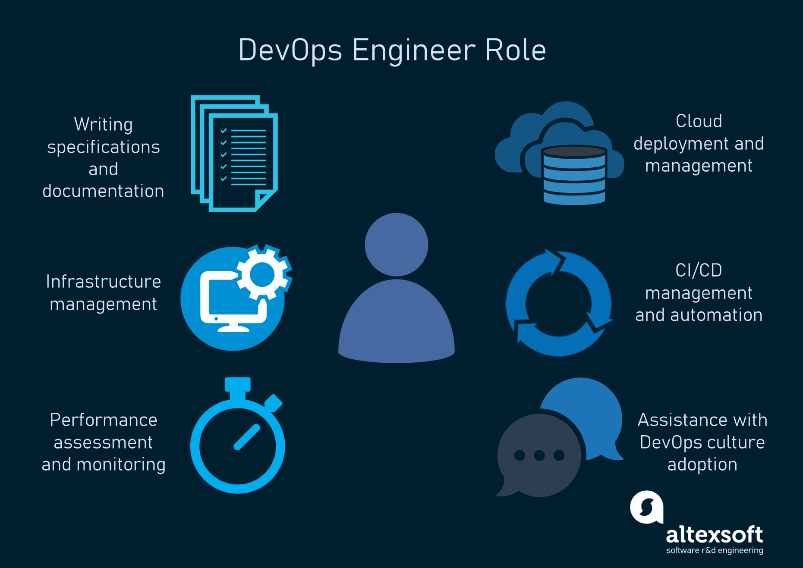
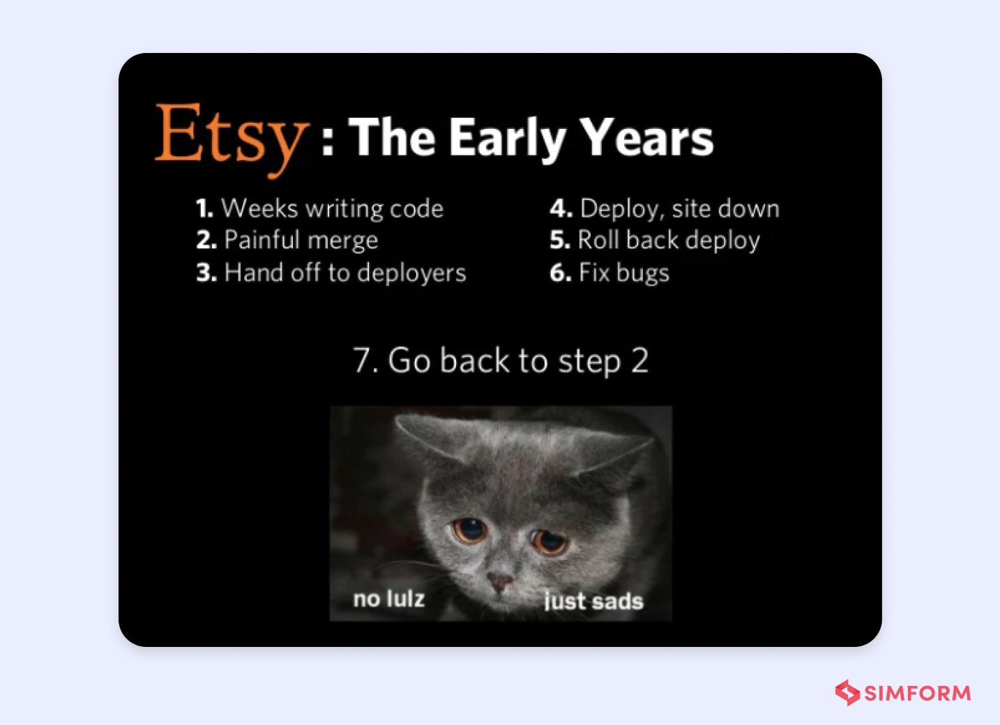

# Introduction to DevOps

## What is DevOps?

An extension of Agile and continuous delivery, DevOps (Development and Operations) is an approach to software development that connects the development and operations teams to work effectively throughout the entire Software Development Lifecycle (SDLC).

*(Source: Atlassian, 2023)*

Through the automation of processes and emphasising collaboration, software can be delivered more quickly and efficiently.

## Benefits of DevOps for businesses

- Faster time to market
- Improved team collaboration
- High quality, frequent software release
- High customer satisfaction
- Operational cost reduction

## What does the role entail?

- Automation of processes
- Infrastructure provisioning
- Managing CI/CD pipeline
- Monitoring and logging of systems
- Ensuring software is operational and continually delivered

*(Source: Altexsoft, 2021)*

## Who do DevOps Engineers work with?

DevOps Engineers work with business stakeholders including everyone involved in the SDLC such as software developers, system operators, system admins and IT operations staff.

## What other teams does a DevOps Engineer interact with?

- Software development team
- Testing and QA team
- Operations team
- Networking team
- Security and governance team

## What are their common deliverables?

Common deliverables for DevOps Engineers include:

- Deployed infrastructure and cloud
- Automation scripts
- Delivered working software/ increment
- The CI/CD pipeline
- Monitoring and logs
- Documentation for server-side features
- DevOps culture adoption

## What is the value of a DevOps Engineer?

DevOps Engineers bring value to a business by streamlining the each stage of the SDLC. They ensure software is continuously delivered in an efficient and reliable way. Overall, leading to a reduction in costs, increased quality and overall productivity.

## How do DevOps Engineers fit into the SDLC?

DevOps Engineers are involved at each stage of the SDLC. From planning and development, through to deployment and monitoring, they work with all teams to ensure the software is streamlined, the CI/CD pipeline is managed and the product is deployed and monitored properly.

## Where can you progress from here?

DevOps Engineers can progress to leadership or more holistic roles such as a DevOps Manager and Solution or Cloud Architect

DevOps Engineers can also progress to SRE (Site Reliability Engineer) and Infrastructure or Platform Engineer.

## What is Cloud Computing?

Cloud computing is on-demand provisioning of IT resources over the internet such as computing power, storage and database servers.

Compared to owning and maintaining physical IT infrastructure, it is cheaper and easier to use a cloud service provider (AWS, Microsoft Azure etc.) to provision infrastructure.

*(Source: <https://aws.amazon.com/devops/>)*

## Who is using DevOps?

### 1. Amazon

Amazon's subsidiary Amazon Web Services (AWS) provides a range of cloud services based on DevOps principles. Amazon and other organisations use AWS cloud services to deliver a vast range of services and products to users around the world.

Amazon focus on automation and use AWS tools such as CodePipeline, CodeBuild, CodeDeploy and CloudFormation to automate CI/CD workflows, build, test and deployment of code and infrastructure management.

### 2. Etsy

Etsy adopted DevOps principles in 2009 for their e-commerce platform. This was due to the disadvantages of using a monolithic architecture and the Waterfall model.

*(Source: Simform, 2022)*

Etsy shifted Culture, which focused on team collaboration and enabled it's staff to make decisions based on situations instead of taking top-down orders. One of the early adopters of DevOps, Etsy implemented a continuous delivery pipeline to quickly and effortlessly deploy code.

*(Source: <https://www.simform.com/blog/etsy-devops-case-study/#:~:text=Etsy%20had%20adopted%20DevOps%20best,the%20traditional%20software%20development%20approaches>.)*

### 3. Netflix

Netflix uses DevOps practices for their streaming platform to deliver on-demand entertainment for subscription-based users.

Netflix had a service disruption due to a database corruption in 2008, leading them to move their infrastructure to the cloud and adopted containerisation to help distribute services to create a reliable and fault-tolerant system.

Netflix embraced "Operate what you build" DevOps principle allowing the development team to also be fully responsible for operating and supporting the system they developed.

*(Source: <https://contactchanaka.medium.com/devops-case-study-netflix-7fe289311c6a>)*
